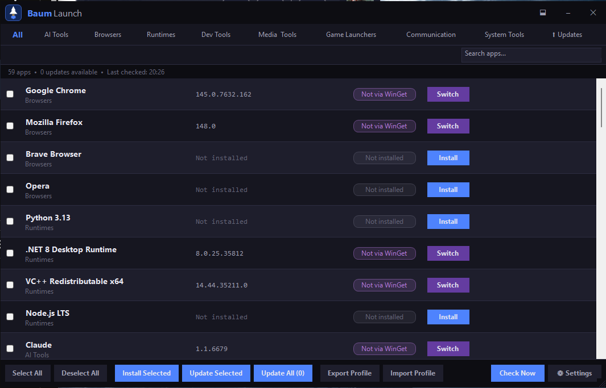

# BaumLaunch

A graphical WinGet-based package manager for Windows that lives in your system tray, keeps your apps up to date, and makes reinstalling a new machine effortless.



---

## Features

### Package Management
- **Curated app catalog** — 59 hand-picked applications across 9 categories, all sourced from the official WinGet repository
- **Install & Switch to WinGet** — install apps you don't have, or switch existing installs to WinGet management with a single click
- **Update All** — one button to silently update every outdated WinGet-managed app at once
- **Live status badges** — each app shows whether it is Up to Date, Update Available, Not Installed, or Not via WinGet
- **Reliable WinGet detection** — app IDs confirmed as WinGet-managed are persisted locally so apps (like Rufus) don't incorrectly revert to "Not via WinGet" between checks

### Search & Filter
- **Search bar** — instantly filter apps by name or category as you type
- **Category tabs** — All, AI Tools, Browsers, Runtimes, Dev Tools, Media & Tools, Game Launchers, Communication, System Tools
- **⬆ Updates tab** — shows all WinGet-managed apps with updates sorted to the top; badge updates dynamically with the count

### System Tray
- **Runs silently in the background** — minimizes to the system tray instead of closing
- **Tray icon** changes colour when updates are available
- **Periodic update checks** — automatically scans for available updates on a configurable interval (default: every 6 hours)
- **Tray context menu** — Open, Check for Updates, Update All, Settings, Exit

### Scheduled Auto-Update
- **Silent scheduled updates** — optionally run `winget upgrade --all` automatically on a set schedule
- **Weekly or Monthly** — pick the day of the week or day of the month
- **Custom time** — set the hour and minute the update fires
- **Balloon notification** when the scheduled update starts and completes

### Setup Profiles
- **Export your setup** — check the apps you want, export your selection to a JSON profile file
- **Import on a new machine** — import a profile after a clean Windows install to instantly know what to reinstall
- **Portable profiles** — save to OneDrive, USB, or share with teammates

---

## App Catalog

| Category | Apps |
|---|---|
| **AI Tools** | Claude, ChatGPT, AnythingLLM |
| **Browsers** | Google Chrome, Mozilla Firefox, Brave, Opera |
| **Runtimes** | Python 3.13, .NET 8 Desktop Runtime, VC++ Redistributable x64, Node.js LTS |
| **Dev Tools** | Git, VS Code, PowerToys, Notepad++, Everything Search, GitHub Desktop, Windows Terminal, Power BI Desktop, draw.io, Raspberry Pi Imager, WSL, Nmap |
| **Media & Tools** | Rode Central, VLC, 7-Zip, OBS Studio, HandBrake, Audacity, GIMP, ShareX |
| **Game Launchers** | Steam, EA Desktop, Epic Games Launcher, Ubisoft Connect, GOG Galaxy, Battle.net, World of Tanks, r2modman, CurseForge |
| **Communication** | Discord, Spotify, Zoom, Slack |
| **System Tools** | OpenOffice, Armoury Crate, MiniTool Partition Wizard, PDFgear, Display Driver Uninstaller, CrystalDiskInfo, Stream Deck, WinDirStat, HWiNFO, BleachBit, Logitech G HUB, iCUE, Rufus, Windows App, Creality Print |

---

## Requirements

- Windows 11 (22H2 / build 22621 or later)
- [WinGet](https://learn.microsoft.com/windows/package-manager/winget/) (included with Windows 11 by default)

No .NET runtime install required — the app is self-contained.

---

## Installation

1. Download `BaumLaunch-Setup-x.x.x.exe` from the [Releases](../../releases) page
2. Run the installer — no admin rights required (per-user install)
3. Optionally enable **Start with Windows** during setup
4. BaumLaunch will open and scan your installed apps automatically

---

## Usage

### Checking for updates
BaumLaunch checks automatically on the interval set in Settings (default: every 6 hours). Trigger a manual refresh any time with **Check Now**.

### Installing or switching an app to WinGet
Click **Install** or **Switch** on any app row. Progress and WinGet output are streamed to a live log panel.

### Update All
Click **Update All** in the toolbar to update every app that has an available upgrade. Updates run sequentially with live output.

### WinGet Updates tab
Shows all apps currently managed by WinGet. Apps with available updates appear at the top. The tab badge shows the update count.

### Scheduled auto-updates
Open **Settings** → **Scheduled Auto-Update**, enable it, pick a schedule (Weekly / Monthly), choose the day and time, and save. BaumLaunch will silently run `winget upgrade --all` at that time and notify you via a tray balloon.

### Exporting a profile
1. Check the apps you want in your profile
2. Click **Export Profile**
3. Save the `.json` file

### Importing a profile
1. Click **Import Profile**
2. Select your previously exported `.json` file
3. Apps in the profile are checked automatically — install any that are missing

---

## Settings

| Setting | Default | Description |
|---------|---------|-------------|
| Start with Windows | Off | Register in `HKCU\...\Run` to launch on login |
| Check for updates on startup | On | Run a status check immediately when the app opens |
| Auto-check interval | 6 hours | How often to scan for WinGet updates in the background |
| Scheduled auto-update | Off | Silently run `winget upgrade --all` on a set schedule |
| Schedule | Weekly, Monday 02:00 | Day and time for the scheduled update |

---

## Building from Source

```bash
git clone https://github.com/Bruiserbaum/BaumLaunch.git
cd BaumLaunch/BaumLaunch
dotnet build
```

To publish self-contained and build the installer:

```bash
dotnet publish -c Release -r win-x64 --self-contained true
# Then run Inno Setup on installer/setup.iss
```

Requires [Inno Setup 6](https://jrsoftware.org/isinfo.php) for the installer.

---

## Related Projects

- [BaumDash](https://github.com/Bruiserbaum/BaumDash) — Audio mixer, Discord integration, media controls, and smart home dashboard for Windows
